# SheRights - Women's Safety and Empowerment Application


## Table of Contents
<ol>
<li>Introduction</li>
<li>Features</li>
<li>Installation</li>
<li>Configuration</li>
<li>Conclusion</li>
<li>Running the application</li>
<li>Contributing</li>
</ol>

## Introduction
SheRights is a React Native application designed to help women stay safe and empowered. The app contains various categories such as Domestic Violence, Education, Reproductive Health, Forced Marriage, Workplace Discrimination, and Sexual Assault. Each category, after clicking on it, is surveyed with 7-option-based questions where each option selected has a score, and at the end of the survey, the total score is calculated for 7 questions, and the severity of the case is displayed to the victim.

Additionally, the app has various informative and therapy sections where users can get good knowledge about various assaults, violence, and how to prevent them. It also has various therapies that would help them heal from any suffering they must be going through. Moreover, the app contains a global chatting function where a victim or user can chat with other users of the SheRights community to get the proper guidance and solution to their problem.

## Features
### Survey Section 📝
The survey section is a crucial part of the application. Users can answer questions based on their situation, and the severity of the case is calculated and displayed. This feature helps women to identify the level of danger they may be in and take necessary action to ensure their safety. The action taken can be classified into either calling to police station immediately if severity comes out to be more than 85% or to contact NGO's nearby if the severity comes out to be less than 85%. 

<p align="left">
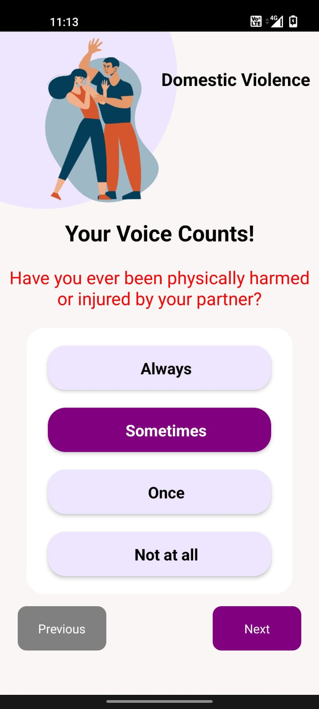
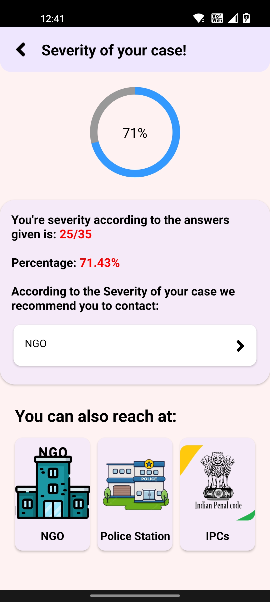
</p>

### Informational Section 💡
The application has various informational sections that educate users on various types of assaults, violence, and how to prevent them. It covers topics such as domestic violence, sexual assault, forced marriage, reproductive health, and workplace discrimination. The section also provides tips and resources to help women stay safe. App also covers various Indian Penal Codes for all the crimes related to women assaults, through which user can get various insights for their situation.

<p align="left">
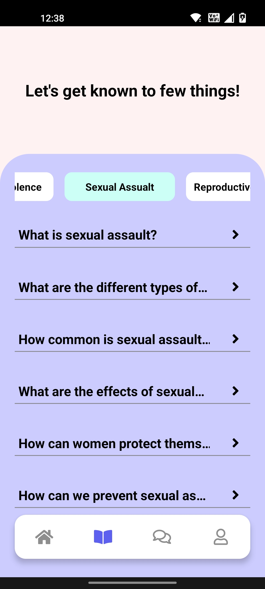
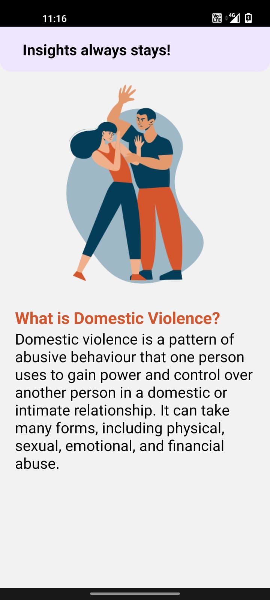
</p>

### Therapy Section 💆🏻‍♀️
The therapy section is designed to help women heal from any suffering they may be going through. It includes various therapies, including meditation, breathing exercises, and guided visualizations. The section provides a safe space for women to seek support and find healing.

<p align="left">
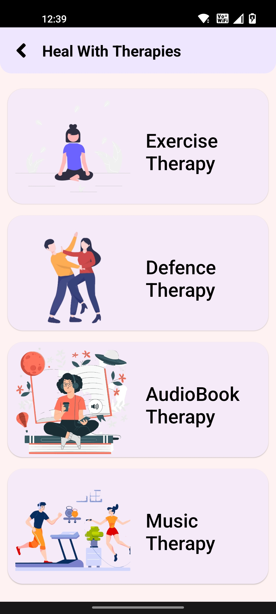
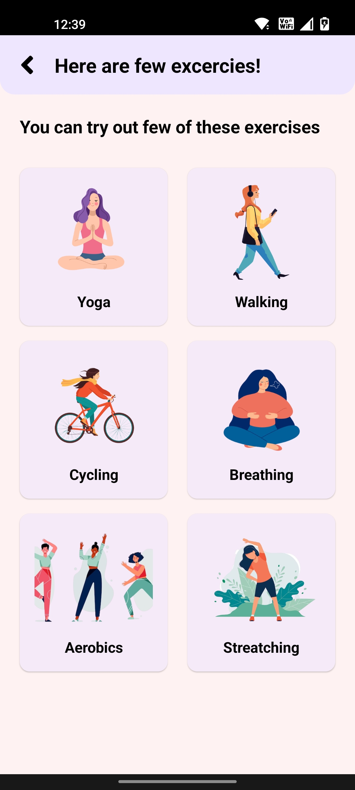
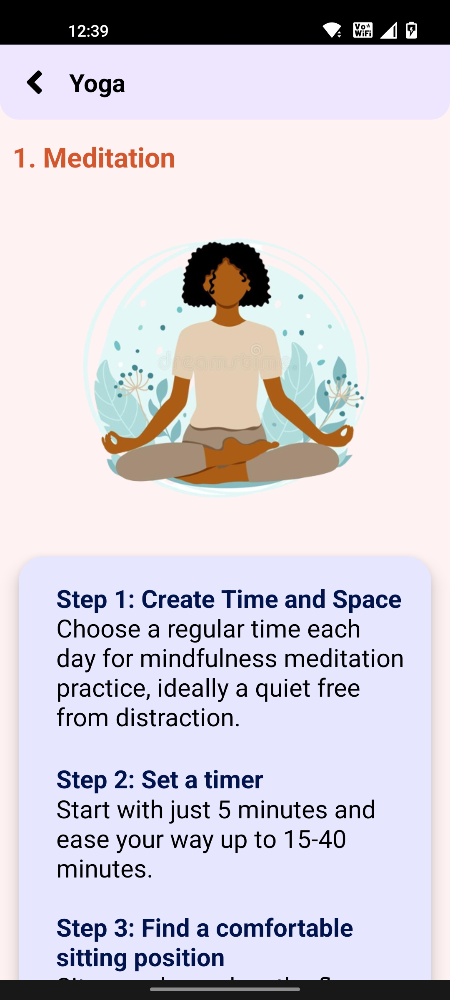
</p>

### Chatting Area 💭
The app contains a global chatting screen where victims or users can chat with other users of the SheRights community to get proper guidance and solutions to their problem. It provides a platform for women to share their experiences and connect with others who may be going through similar situations.

<p align="left">
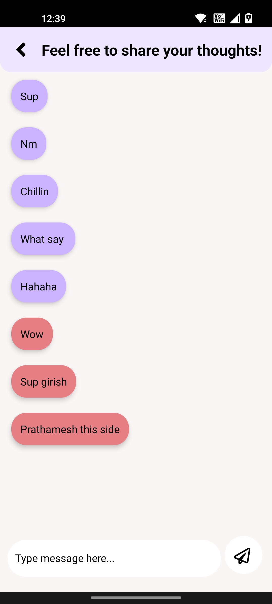
</p>

### User-Friendly Interface 📱
The app is user-friendly and easy to navigate. Users can access all features of the application easily, and the interface is designed to be simple and intuitive.

<p align="left">
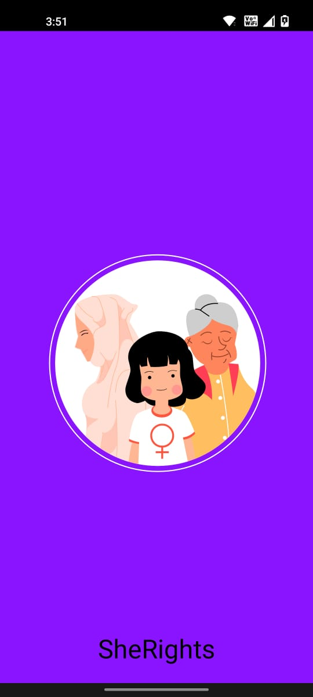
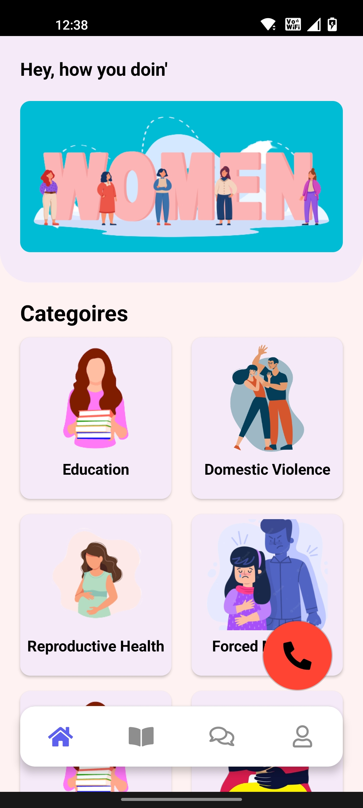
</p>

### Resources 📚
The application provides users with access to resources such as Police Stations and NGO's contact number and addresses. This feature helps women to seek help quickly and easily in no time.

<p align="left">
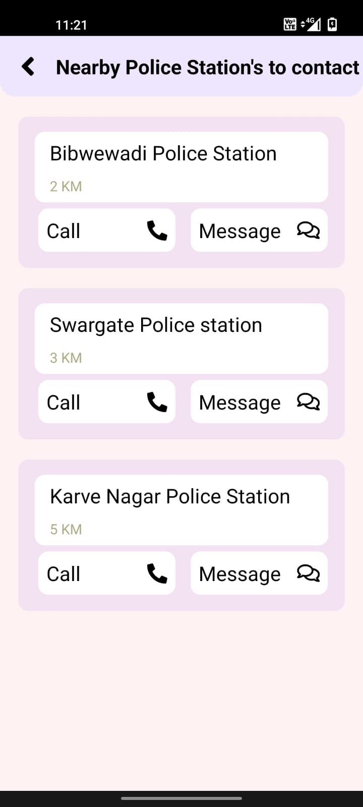
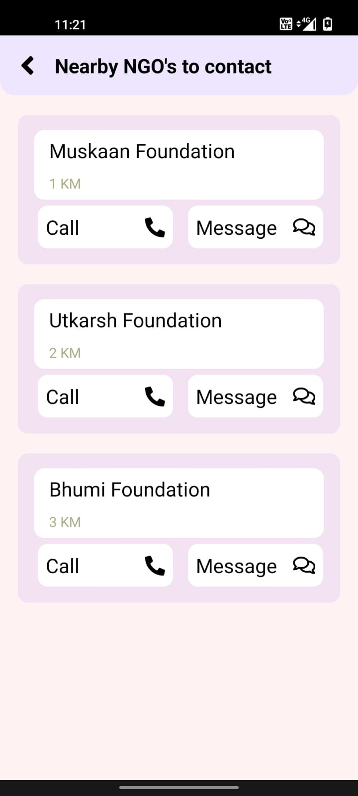
</p>


## Installation
To run this app, follow the steps below:
<ol>
<li>Clone the repository, open cmd in the desired folder and type:</li>

```
git clone https://github.com/SheRights/SheRights-Application.git
```

<li>Navigate to the project's root directory.</li>
<li>Install the project dependencies using:</li>

```
npm install
```

</ol>

## Configuration
SheRights uses Firebase for authentication and database. To use Firebase in the app, you will need to create a new Firebase project and add the configuration details to the project. Here's how:
<ol>
<li>Create a new Firebase project on the Firebase Console.</li>
<li>Navigate to the project's settings and click on the "Add Firebase to your app" button.</li>
<li>Copy the Firebase configuration object.</li>
<li>Download Google-Services file and place it in your project.</li>
</ol>

## Running the Application
To run the application on your device or emulator, run the following command:
<ol>
<li>Open command prompt in your root directory and run:</li>

```
npx react-native start
```

<li>Open command prompt in your root directory and run:</li>

```
npx react-native run-android
```

</ol>
This will start the React server and open the React Developer Tools in your prompt. From here, you can choose to run the app on a physical device, emulator and start the test runner and run all the tests for the application.

## Conclusion
That's it! You now have a fully functional SheRights application running on your device or emulator. Feel free to explore the application and test out its features. If you have any feedback or suggestions for the application, please feel free to contact us. We hope that SheRights can make a positive impact on the lives of women worldwide.

## Contributing
We welcome contributions to SheRights. If you have any ideas or features you would like to add, please feel free to fork the repository and make a pull request.

* Fork the repository
* Create a new branch with your feature or bug fix.
* Push your changes to the new branch.
* Make a pull request.
